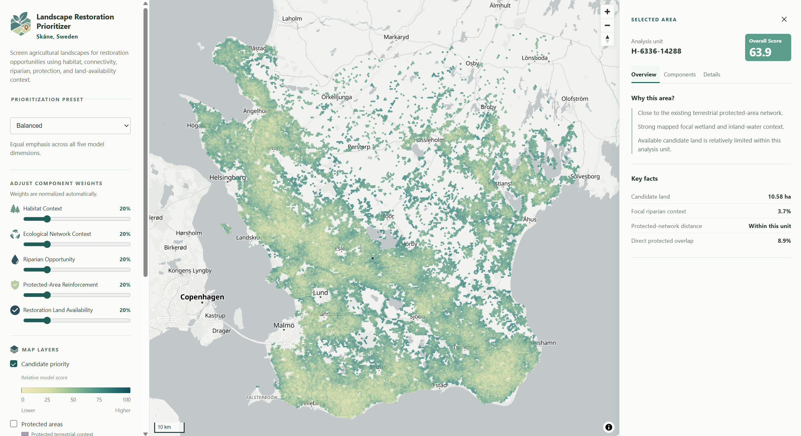

# Landscape Restoration Prioritizer

A landscape-restoration screening tool for Skåne, Sweden. It combines land-cover, protected-area, and other environmental data to help identify places worth investigating for restoration.

The question behind the project is simple: **where should a conservation organization investigate restoration opportunities first, and why?**

## Live demo

[Open the application](https://landscape-restoration-prioritizer.pages.dev/)

[](https://landscape-restoration-prioritizer.pages.dev/)

## What it does

The model evaluates candidate 500 m hexagons across Skåne using five spatial criteria.

The web app includes:

- three prioritization presets, plus adjustable component weights
- a ranked Top Candidates shortlist
- protected-area and wetland/inland-water context layers
- an inspector showing how each selected analysis unit scores

## Method

The prioritization model uses five components:

- **Habitat Context** — surrounding mapped semi-natural habitat
- **Ecological Network Context** — the spatial configuration of habitat around each candidate
- **Riparian Opportunity** — mapped wetland and inland-water context within the candidate
- **Protected-Area Reinforcement** — proximity to terrestrial protected areas
- **Restoration Land Availability** — mapped arable land within the candidate

Each component is converted to a relative 0–100 score across the eligible candidate population and combined using preset or user-adjusted weights.

The full methodology, including formulas and assumptions, is documented in [docs/methodology.md](docs/methodology.md).

## Data

The main source datasets are:

- SCB DeSO 2025 boundaries
- Naturvårdsverket NMD2023 Basskikt v2.1
- Naturvårdsverket protected-area data
- Natura 2000

See [docs/data-sources.md](docs/data-sources.md) for source details, licensing, and known limitations.

## Stack

The processing pipeline is built with Python, GeoPandas, Rasterio, Shapely, PyProj, NumPy, and pandas.

The frontend uses React, TypeScript, MapLibre GL JS, and Vite, and is deployed as a static site on Cloudflare Pages.

## Running locally

Create a Python environment and install the project:

```bash
python3.12 -m venv .venv
.venv/bin/python -m pip install -e ".[dev]"
```

After preparing the source data described in docs/data-sources.md:

```bash
.venv/bin/python -m restoration_prioritizer.prioritization_model
.venv/bin/python -m restoration_prioritizer.web_delivery

cd web
npm ci
npm run build
npm run preview
```

Generated delivery files are copied from `data/processed/` into ignored frontend assets under `web/public/data/`.

## Limitations

This is a regional screening model, not parcel-level restoration advice. Scores are relative to the candidate population and should not be interpreted as ecological probabilities or evidence that restoration is feasible at a particular location.

The wetland and inland-water overlay is generalized for display, and the underlying datasets do not capture land ownership, permissions, field conditions, or other site-level constraints.

More detail is available in the methodology, data delivery notes, application notes, and deployment notes.

More detail is available in the [methodology](docs/methodology.md),

[data delivery notes](docs/web-delivery.md),

[application notes](docs/application-ui.md), and

[deployment notes](docs/deployment.md).

## License

Code in this repository is available under the MIT License.
Source datasets retain their respective licenses and terms; see
[docs/data-sources.md](docs/data-sources.md).
